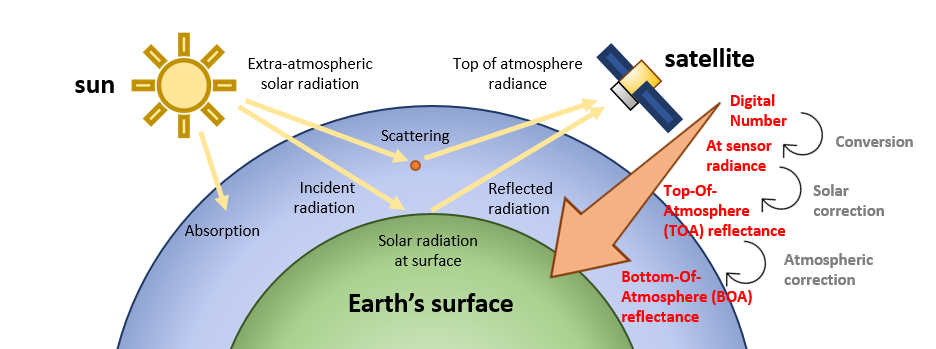
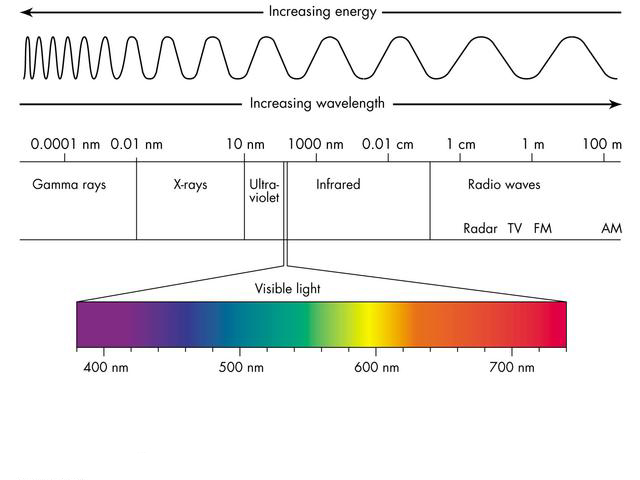

---
---
---

The aim of this document is to show how to handle **multispectral imagery** in `R` from major **publicly-available data archives**. These materials teach you the basic/intermediate concepts to retrieve, manage, and process satellite images locally (in your computer) in a simple and effective manner with `rsat`. The package is intended to deal with time series of satellite images from various sources in a standardized, semi-automated, and efficient manner. `rsat` replaces `RGISTools`, our previous package ($\sim 7500$ downloads), with a simpler, more efficient, and extended workflow. Materials are organized as follows:

i.  **Introduction** - theory about multispectral images, data types and their organization.
ii. **Tinkering with satellite `records`** - standardizing and filtering image metadata.
iii. **Managing your `rtoi`** - building your region and time of interest.
iv. **Basic processing** - customizing images for the objectives of the study.
v.  **More advance processing** - completing and harmonizing multi-source data sets.

------------------------------------------------------------------------

# Introduction

In this introductory section, the goal is understanding the basic notions of multispectral images (Section \@ref(theory-images)) and clarify how they are organized in the data archives (Section \@ref(theory-archives)). Both are helpful to determine what images to use and where to find them. We won't explain both aspects in detail but enough to understand the code and its intention. Alongside explanations, we run embedded code examples so it is key that your software is up-to-date.

------------------------------------------------------------------------

## Software installation

Check that you are using the latest version of `R` and `RStudio`. Otherwise, click [here](https://cran.r-project.org/bin/windows/base/) and [here](https://rstudio.com/products/rstudio/download/) to install both (in that order). Then, use the following commands to install `rsat` from our [Github repository](https://github.com/spatialstatisticsupna/rsat):

```{r eval=FALSE}
# load devtools library
library(devtools)

# Install rsat from the GitHub repositoy
install_github("ropensci/rsat")
```

### Linux

If you are using Linux, you need to install some additional libraries before installing `R`. See the commands below to install all the applications for *Debian/Ubuntu* and *RedHat/Fedora*.

### *Debian/Ubuntu*

        sudo apt update
        sudo apt install r-cran-rcpp gdal-bin libgdal-dev libproj-dev libssl libssl-dev xml2 libxml2-dev libmagick++-dev

### RedHat/Fedora

        sudo dnf install gdal gdal_devel proj_devel xml2 libxml2_devel libcurl_devel openssl_devel ImageMagick-c++_devel

------------------------------------------------------------------------

## Multi-spectral images {#theory-images}

As mentioned earlier, `rsat` allows you to access and process ***optical satellite images*** (for now). We focus on this type of images because it is perhaps one of the most popular data products. It has proven to be a very valuable source of information in many fields such as ecology, agronomy, hydrology, or economic sciences. Note that satellites can provide several other data products beyond multispectral images, e.g. aerosol or atmospheric gas concentrations, digital elevation models (DEMs), etc.

Multispectral satellite images are measurements of ***electromagnetic radiation*** captured by ***passive*** (*vs.* active) sensors aboard satellites. Passive sensors measure the radiation emitted by external sources like the sun (*vs.* emitting radiation themselves). The sun emits radiation which passes through the atmosphere an reaches the earth's surface, where it is absorbed or reflected. Reflected radiation travels again through the atmosphere to the sensing device. On its way through the atmosphere, light is absorbed or scattered due to interaction of radiation with atmospheric particles.

{width="658" height="255"}

Sensors, atmosphere, topography, and the sun distort the radiation measurements. Data providers pre-process the images to compensate for these disturbances. There are several ***processing levels*** depending on the corrections applied. For convenience, in this course we deal with *Level 2*. *Level 2* images provide the ***surface reflectance*** - reflected radiation relative to the incident radiation as would be measured close to ground level. Surface reflectance is a ratio so it has no units and values usually range between $0$ and $1$. *Level 2* images are comparable in space and time. Even though *Level 2* is the primary focus in these tutorials, `rsat` also gives you access to lower or higher processing levels if needed.

Correction algorithms are constantly updated or improved. When the upgraded algorithms is applied to pre-existing and new images, data providers release a new ***collections or versions*** . For instance, until few months ago, Landsat imagery had available their [Collection 1](https://www.usgs.gov/core-science-systems/nli/landsat/landsat-collection-1?qt-science_support_page_related_con=1#qt-science_support_page_related_con). They recently enhanced their algorithms and they just created the [Collection 2](https://www.usgs.gov/core-science-systems/nli/landsat/landsat-collection-2?qt-science_support_page_related_con=1#qt-science_support_page_related_con).

{width="470"}

Electromagnetic radiation can be described as a continuous ***spectrum*** of wavelengths. Our eyes perceive a small portion of the entire spectrum ($400-700nm$), which is referred to as visible spectrum. Sensors on board satellites capture slices of the spectrum, called ***bands***, in and beyond the visible range. We talk about ***multispectral*** images when the number of bands is in the order of $10$s and ***hyperspectral*** when it is in the order of $100$s. Objects and colors can be detected thanks to the distinctive amount of radiation (***intensity***) that they reflect in each band.

------------------------------------------------------------------------

## Data structure {#theory-archives}

### Programs, missions, and satellites

Multispectral images are freely available thanks to satellite ***programs*** supported by public agencies. The three major satellite programs are [Landsat](https://landsat.gsfc.nasa.gov/) (NASA/USGS), [MODIS](https://www.copernicus.eu/es) (NASA), and [Copernicus](https://www.copernicus.eu/es) (ESA).

Programs can develop one or several ***missions*** and, for each mission, agencies launch one or multiple satellites to meat a particular goal (e.g., weather observation, land monitoring, sea-level surveillance). For instance, the Landsat program has carried out 8 missions so far (Landsat-1/8) and there is a 9th on the making (launch scheduled on spring 2021).

Missions are accomplished by ***satellites*** which carry specific ***sensors*** or instruments for the task. When several satellites are devoted to a single mission they are referred to as ***constellations***. For instance, the Terra and Aqua satellites from the constellation of the MODIS mission. A list of on-going governmental programs and their missions, satellites, and sensors can be found below.

### Data products

#### Tiling systems

Sensors scan the earth's surface in a continuous fashion. Data records are deliberately broken into pieces so they can be processed and shared more easily. The divisions follow a pre-established grid system formed by cells or ***tiles*** (e.g., see the interactive map below). We recommend you to know in advance which tiles cover your area of interest, even though the tile selection is made automatically by `rsat` .

<center>

{width="459"}

\<\center\>

Tiling systems differ among programs/missions:

-   **Landsat 4-8:** The tiling system is the [*World Reference System 2*](https://landsat.gsfc.nasa.gov/about/worldwide-reference-system). Tiles are identified according to their path and row numbers which specify their location from East to West and North to South respectively.

-   **Sentinel-2**: Uses the [Military Grid System](https://hls.gsfc.nasa.gov/wp-content/uploads/2016/03/MGRS_GZD-1.png). In this system, the earth's surface is divided into 60 vertical zones (UTM zones) and 20 horizontal zones. Vertical strata are designated by numbers increasing from East to West. Horizontal segments are represented by letters from South to North.

-   **MODIS:** Divides the earth according to the [Sinusoidal tile grid system](https://modis-land.gsfc.nasa.gov/MODLAND_grid.html). Tiles are identified based on their horizontal and vertical location in a regular grid. Here also the numbers increase from East to West and North to South**.**

The tiling systems mentioned above are available as polygons in `rsatExtra`. These polygons can be loaded and used to check the overlap between the *ROI* and the tiles. Let's display the sinusoidal tile grid system from MODIS;

```{r, fig.align='center', fig.cap = "MODIS Tiling system",eval=FALSE}
library(rsatExtra)
library(tmap)
data("modis_tiles")
tmap_mode('view')
tm_shape(modis_tiles) + tm_polygons(alpha = 0, border.col = "red")
```

#### Product characteristics

The orbit and sensors of satellites/constellations provide images of different resolutions (in its broadest sense). Here, the term ***resolution*** refers to the level of detail in some aspect of the image:

-   ***Spatial resolution*** is related to the area covered by a single pixel. High-resolution images contain small pixels, i.e. they cover small surface areas. Among the missions mentioned before, Sentinel-2 is the one offering images with the highest resolution ( $\sim 10\times 10m$ per pixels).

-   ***Temporal resolution*** is related to the time span between two successive images. When images are frequent, they provide a high temporal resolution. For instance, MODIS Terra and Aqua revisit daily so it the program with the highest temporal resolution. Another aspect to consider is the temporal extension of data products. Because satellites are launched and decommissioned, their associated products are available for a limited period of time.

-   The **spectral resolution** corresponds to the number of bands and their wavelength range. The MODIS sensor, with its $36$ bands in total, is the sensor with the highest spectral resolution.

    . Source: USGS"){width="429"}

Selecting the right product depends on the objective of the study and the extension of the *ROI*. The features of different missions and satellites are collected into a single look-up table [here](https://drive.google.com/file/d/1cSw4LaTLPlGBHmG8v7uwH54f-m9jZz1N/view?usp=sharing). Web services

#### Names

As mentioned earlier, these tutorial mostly concern ***multispectral images*** capturing ***surface reflectance*** values (`rsat` gives access to products with other levels of pre-processing). Short-names or ***ID**s* identify the data products . The product names for the on-going missions are listed below. We rely on `rsat`'s manual and tables like the one below to remember the *IDs* of each data product. After a while you will learn them by heart.

```{r data_table, echo=FALSE, message=FALSE, warning=FALSE, results='asis'}
library(pander)
data <- "
  Program    | Mission    | Satellite | Sensor | ID             
  Landsat    | Landsat-7  | Landsat-7 | ETM    | LANDSAT_ETM_C1
  Landsat    | Landsat-8  | Landsat-8 | OLI    | LANDSAT_8_C1
  MODIS      | MODIS      | Terra     | MODIS  | MOD09GA
  MODIS      | MODIS      | Aqua      | MODIS  | MYD09GA
  Copernicus | Sentinel-2 | 2A        | MSI    | S2MSI2A
  Copernicus | Sentinel-2 | 2B        | MSI    | S2MSI2A
  Copernicus | Sentinel-3 | 3A        | OLCY   | SY_SYN__
  Copernicus | Sentinel-3 | 3B        | OLCY   | SY_SYN__
"
df <- read.delim(textConnection(data),header=FALSE,sep="|",strip.white=TRUE,stringsAsFactors=FALSE)
names(df) <- unname(as.list(df[1,]))
df <- df[-1,]
row.names(df)<-NULL
pander(df, style = 'rmarkdown', caption = "Operational missions collecting multi-spectral satellite images and their relevant details")
```

### Web services

Information collected from satellites is saved in repositories which can be freely accessed using ***web services***. Web services work as an interface between the user and the data repositories, finding and retrieving the requested data-sets to the user. In order to obtain multispectral images from the three programs, sign-up in the following web services. For convenience, try to use the same *username* and *password* for all of them. To satisfy the criteria of all web services make sure that the *username* is $4$ characters long and includes a period, number or underscore. The password must be $12$ character long and use characters (at least one capital letter) and numbers:

-   **EarthData** : [\<https://urs.earthdata.nasa.gov/users/new\>](https://urs.earthdata.nasa.gov/users/new){.uri}

-   **Scihub** : [\<https://scihub.copernicus.eu/dhus/#/self-registration\>](https://scihub.copernicus.eu/dhus/#/self-registration){.uri}

-   **EarthExplorer**: [\<https://ers.cr.usgs.gov/register\>](https://ers.cr.usgs.gov/register){.uri}

### Credentials

Two functions in `rsat` help us handling the *usernames* and *passwords* for the various APIs; `set_credentials()` and `print_credentials()`*.* The function `set_credentials()` indicates to `rsat` which `username` (first argument) and `password` (second argument) should be used for which `service` (third argument). The code below assigns to `scihub` our personal *username* and *password* :

```{r, cache = TRUE, cache.path="cache/"}
library(rsat)
set_credentials("rsat.package","UpnaSSG.2021","scihub")
```

The function `print_credentials()` displays on all the *usernames* and *passwords* required in `rsat` to gain full access to products handled by `rsat`. Undefined credentials remain empty (`""`):

```{r, cache = TRUE, cache.path="cache/"}
print_credentials()
```

If *usernames* and *passwords* are the same for all web services (our advice), we can set all of them with a single instruction :

```{r echo=FALSE}
# set API credentials
set_credentials("rsat.package", "UpnaSSG.2021")
```

#### Demo #1: MODIS download using the EarthExplorer portal

Web services offer online portals to request remote sensing products via *Graphical User Interfaces (GUI)*. We will conduct a small demonstration using *EarthExplorer's* GUI to find MODIS images covering Navarre between `03/05/2019` and `05/05/2019`. In our jargon, Navarre is referred to as ***Region of Interest (ROI)*** and the time-span is our ***Time of Interest (TOI)***.

1.  Go [here](https://earthexplorer.usgs.gov/) and log-in. The web page sends you to a new site. The website displays a menu on the left and a map on the right. Search Navarre on the map. Pick the polygon tab on the menu and draw a polygon around the region (see the gif below). Fill-in the starting and ending dates in the appropriate field of the form (at the bottom). Then click the *Data Sets* button.

    

2.  Select the data product on the panel on your left. Find for instance the *MOD09GA* product (we explain below what this is) expanding the menu under *NASA LPDAAC Collections*. Then click on *MODIS Land Surface Reflectance V6*. Pick the *MOD09GA* product and click on *Results.* A pop-up message appears indicating the system is searching the available images.

    

3.  The results are displayed on the left. You should see three results (one image for each day). You could download the image by clicking on the icon with a green arrow pointing downwards, and then repeat the process with every image in the list.

    

Data portals are straightforward and intuitive. However, they can be tedious when requesting images for longer periods of time or several data products. In these situations, `rsat` becomes handy. The package enables you to send requests from `R` to the appropriate web service easily and programatically using *Application Programming Interfaces (APIs)*. You can judge in the next section where the same example is repeated using `rsat`.

# Tinkering with satellite records - standardizing and filtering image metadata.

Searching, filtering, and downloading are the basic operations needed for creating your own satellite imagery data set. There are multiple libraries and applications for searching and downloading satellite images, but most of them follow the same two processes:

1.  Search: taking at least a region and time and of interest

2.  Download: acquiring all the images filtered by arguments such as "cloud percentage" but without visualization.

Usually this processes works as a black box, but previewing as a prior step to download is an important operation to discard images very affected by atmospheric factors. Landsat, MODIS, and Sentinel programs provide a web application to preview the images on maps before the download but, the one-by-one visualization using the graphic user interface requires some minutes for each date.

The `rsat` package introduces a new previewing procedure based on `R` and the metadata of the satellite images. The preview is designed to speed up and improve the data filtering using `R` commands. Additionally, this faster previewing helps discarding scenes before download therefore gaining time and hard drive space in your computer.

The procedure computationally requires a dedicated data structure to manage the metadata of satellite imagery. The designed data structure is the `records`. This data structure contains all the metadata of an image, such as; name of the satellite, name of the image, capturing date, product name, spatial extension or the url to acquire the previewing image. The following table shows all the slots in a `records`.

```{r table-simple, echo=FALSE, message=FALSE, warning=FALSE, results='asis'}
require(pander)
panderOptions('table.split.table', Inf)
set.caption("The parameters in records and its description")
my.data <- "
  Slot name | Data type | Description    
  sat      | character | Stores the satellite name: Modis, Landsat, Sentinel-1, Sentinel-2, ...
  name      | character | Stores the name of the tile used by its program, for example one of the Modis image name is MOD09GA.A2019123.h17v04.006.2019125233112
  
  date      | Date | Observation date
  product      | character | Name of the product, 
  path      | numeric | in Modis and Landsat images, the path of the tile, otherwise is null
  row      | numeric | in Modis and Landsat images, the row of the tile, otherwise is null
  tileid      | character | in Sentinel images, the tile id
  download      | character | The url where the image is avaliable for download
  file_path      | character | The relative path for local store of the image
  preview      | character | The url of a preview image, usually jpeg image
  api_name      | character | The internal api name used by rsat
  order      | logical | Logical argument, if TRUE the image need to be ordered before the download
  extent_crs      |  extent_crs |  crs data for adding projection to preview images "
df <- read.delim(textConnection(my.data),header=FALSE,sep="|",strip.white=TRUE,stringsAsFactors=FALSE)
names(df) <- unname(as.list(df[1,])) # put headers on
df <- df[-1,] # remove first row
row.names(df)<-NULL
pander(df, style = 'rmarkdown')
```

Creating a `records` variable from scratch is a hard job, it is necessary to known all the parameters in advance. To ease this procedure, the packages defines a searching function that produces a set of records containing the metadata of all the images in the search result. This procedure searches the images based in a time of interest and a region of interest.

## Set up `records` class

The easiest way to create a `records` class is using `rsat_search` function. This function is able to call to different APIs to get satellite metadata as `records`.

```{r, cache=TRUE ,eval=TRUE, cache.path="cache/"}
library(rsat)

# set API credentials
set_credentials("rsat.package", "UpnaSSG.2021")
```

`rsat_search` function takes some parameters for searching satellite records from multiple APIs. It needs at least an spatial region, the product and a date interval. The region is defined with a spatial feature (`sf`) and the time with `Date` class.

```{r, cache=TRUE ,eval=TRUE, cache.path="cache/"}
data("ex.manhattan")
plot(ex.manhattan)
class(ex.manhattan)
toi <- as.Date("2020-01-01") + 0:385
```

```{r, cache=TRUE ,eval=TRUE, cache.path="cache/"}
# search in the APIs
search.records <- rsat_search(region = ex.manhattan,
                             product = c("S2MSI2A","LANDSAT_8_C1"),
                             dates = toi)
class(search.records)
```

### Basic operations with `records`

The main benefit of using this package for managing satellite imagery is that it works with huge amount of image metadata before the downloading process. Once you create a `records` with the satellite images you need, the package provides functions for sorting, previewing and filtering the data.

`records` class takes the R vector object as reference. `vector` class provides simple but powerful operations such as `c`, `subset`, `length`, `print`, etc.

```{r, cache=TRUE ,eval=TRUE, cache.path="cache/"}
#TODO vector use in R
```

**Exercise:** without using the function `as.Date` create an R vector that contains the dates that appear at least 2 times in `my.dates1`, `my.dates2` and `my.dates3`.

1.  How many dates are the 3 dates variables?

```{r, cache=TRUE ,eval=TRUE, cache.path="cache/"}
my.dates1 <- as.Date("2020-01-01") + 0:31
my.dates2 <- as.Date("2020-02-01") + 0:29
my.dates3 <- as.Date("2020-03-01") + 0:31

#TODO complete the exercise here

c(my.dates1[length(my.dates1)],my.dates2[length(my.dates2)])
```

The `records` class uses the same functions to manage the images before the download.

```{r, cache=TRUE ,eval=TRUE, cache.path="cache/"}
length(search.records)
plot(search.records[1:2])
```

```{r, cache=TRUE ,eval=TRUE, cache.path="cache/"}
dates(search.records[1:10])
names(search.records[1:10])
print(search.records[1])
```

### Plotting and previewing records

```{r, cache=TRUE ,eval=TRUE, cache.path="cache/"}
plot(search.records[5])

library(tmap)
plot(search.records[5])+tm_shape(ex.manhattan)+tm_polygons(col="grey", border.col="red")

#plot(search.records[1:5])+tm_shape(ex.manhattan)+tm_polygons(col="grey", border.col="red")

plot(search.records[1:5],
     region=ex.manhattan,
     tm.polygon.region.border.col="red",
     tm.polygon.region.col="grey",
     tm.polygon.region.alpha=1,
     compass.rm=T,
     scale.bar.rm=T)
```

{width="682"}

#### Exercise

Select and plot 5 cloud-free images from `search.records` in manhattan.

```{r, cache=TRUE ,eval=TRUE, cache.path="cache/"}
#TODO complete the exercise here
```

## Filtering `records` before the download

The objective of this example is to download an image from Landsat-8 and an image from Sentinel-2 of the same date and cloud free for Manhattan.

### Using `subset` function

Split Landsat and Sentinel images from `search.records` using `subset`.

```{r, cache=TRUE ,eval=TRUE, cache.path="cache/"}
print(unique(sat_name(search.records)))

landsat8 <- subset(search.records,"Landsat-8",subset = "sat")
sentinel2 <- subset(search.records,"Sentinel-2",subset = "sat")
```

### Using vector-like operations for filtering

```{r, cache=TRUE ,eval=TRUE, cache.path="cache/"}
length(search.records)
length(landsat8)
length(sentinel2)

dates(landsat8)[dates(landsat8) %in% dates(sentinel2)]

landsat8.match <- landsat8[dates(landsat8) %in% dates(sentinel2)]
sentinel2.match <- sentinel2[dates(sentinel2) %in% dates(landsat8.match)]
length(landsat8.match)
length(sentinel2.match)
```

```{r, cache=TRUE ,eval=TRUE, cache.path="cache/"}
length(landsat8.match)

length(sentinel2.match)

plot(landsat8.match[1:10])


landsat8.match[5]
rm.tile <- subset(landsat8.match,14,subset = "path")
rm.tile <- subset(rm.tile,31,subset = "row")
landsat8.match <- landsat8.match[!names(landsat8.match)%in%names(rm.tile)]
```

```{r, cache=TRUE ,eval=TRUE, cache.path="cache/"}
plot(landsat8.match[1:10])
landsat8.cloud.free <- landsat8.match[c(1,3,7,10)]

plot(landsat8.match[11:19])
landsat8.cloud.free <- c(landsat8.cloud.free,landsat8.match[c(17,19)])

plot(landsat8.cloud.free)
landsat8.cloud.free <- landsat8.cloud.free[c(1,2,3,4,6)]
```

```{r, cache=TRUE ,eval=TRUE, cache.path="cache/"}
# filter sentinel
sentinel2.cloud.free <- sentinel2.match[dates(sentinel2.match)%in%dates(landsat8.cloud.free)]

july6 <- dates(sentinel2.cloud.free)[1]
landsat8.july6 <-landsat8.cloud.free[dates(landsat8.cloud.free)%in%july6]
sentinel2.july6 <-sentinel2.cloud.free[dates(sentinel2.cloud.free)%in%july6]

# plotting same date for landsat and sentinel
plot(c(landsat8.july6,sentinel2.july6))
```

## Downloading

The download is done the same as with the `rtoi` class, using `rsat_download` function.

```{r, cache=FALSE ,eval=TRUE, cache.path="cache/"}
out.dir="D:/CursoRSAT/DATABASE"
july6.records <- c(landsat8.july6, sentinel2.july6)
rsat_download(july6.records, out.dir=out.dir)
```

## Searching a region from scratch

The `rsat` package has been designed to match with `sf`, `raster`, `tmap` packages and create an ecosystem for satellite image processing. In this section we introduce an example of a download of region from scratch. 
### `raster` package 
The package `raster` within its functions provides the access for all the world countries and regions. This function is `getData`. With this function we can get regions in spatial points (`sp`) class.

```{r, cache=FALSE ,eval=TRUE, cache.path="cache/"}
library(raster)
spain<-getData('GADM', country='Spain',path="D:/rsat/CursoRSAT/countries",level=2)
plot(spain)
```

### `sp` vs `sf`

`sf` package is called to be the replacement of `sp` package, but up to now both packages are complementary. Many actual packages and functions continue using `sp` as main spatial reference, for example the `getData` function.

```{r, cache=FALSE ,eval=TRUE, cache.path="cache/"}
names(spain)
unique(spain$NAME_0)
unique(spain$NAME_1)
unique(spain$NAME_2)
galicia<-spain[spain$NAME_1=="Galicia",]
plot(galicia)
```

The conversion from `sp` to `sf` can be done easily with only one function `st_as_sf`.

```{r, cache=FALSE ,eval=TRUE, cache.path="cache/"}
library(sf)
class(galicia)
galicia<-st_as_sf(galicia)
plot(galicia)
class(galicia)
```

### `rsat_search`

Once with translate from `sp` to `sf` we can use `rsat_search` as we use in the previous example for searching the tiles over our region of interest and out time of interest.

```{r, cache=FALSE ,eval=TRUE, cache.path="cache/"}
galicia.records <- rsat_search(region = galicia,
                              product = "LANDSAT_8_C1",
                              dates = as.Date("2020-01-01")+c(0,15))
plot(galicia.records[2], region=galicia, tm.polygon.region.border.col="red")
```

## Exercise

Your turn: We want you to search ([***do not download!***]{.underline}) a cloud-free multispectral images captured by Landsat-8 (`"LANDSAT_8_C1"`) and Sentinel-2 (`"S2MSI2A"`) in Andorra during all $2020$. Try to do it with one single `sat_search()` instruction and use `plot()` for plotting the images. Use [***your own credentials***]{.underline}.

```{r, cache=TRUE ,eval=TRUE, cache.path="cache/"}
#TODO complete the exercise here
```
