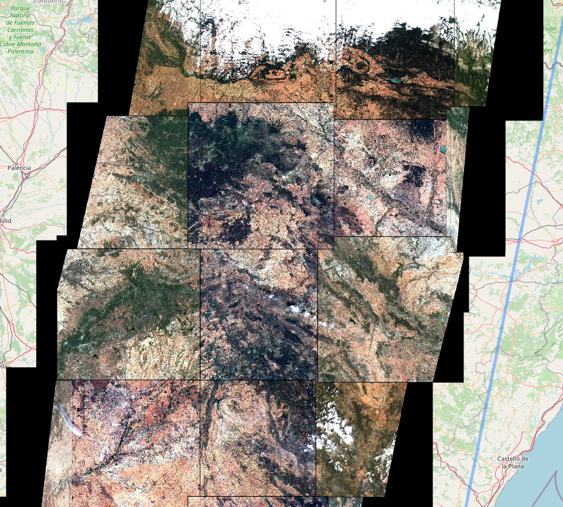
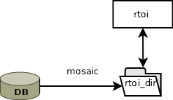
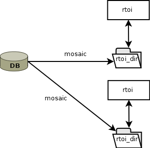
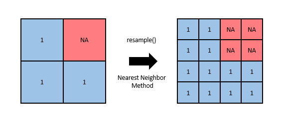

# Managing your region and time of interest

Satellites capture images of the earth's surface from north to south. The capture is divided into tiles. When the object of the analysis is a region, these tiles tiles must be rejoined.

{width="365"}

The records class is designed to work on quadrants. However, we usually need more than one tile to cover the region of our analysis. The package implements the `rtoi` class to deal with regions.

## What is an `rtoi`?

`rtoi` is the object designed to manage regions consisting of several tiles. The object is composed of 3 parts:

1.  The database address (db_path);

2.  The object loaded in R;

3.  The folder with all the processed data of the region of interest.

In the R environment, `rtoi` is a special object of R cataloged as an S6 object. The `rtoi` behaves like an object in any programming language that follows the object-oriented paradigm. This means that if we introduce the `rtoi` inside a function, and the information of the `rtoi` is modified, that change updates the main R environment.

{width="322"}

## Basic `rtoi` functions

We will use the Madrid region as a reference. The objective will be to get one cloud-free image of Madrid from Landsat-8 and Sentinel-2. We will start by defining the region and dates for the study.

### Set credentials

Before we begin, we must assign the credentials. We will use the function set_credentials.

```{r, cache=TRUE ,eval=TRUE, cache.path="cache/"}
library(rsat)

# set API credentials
set_credentials("rsat.package", "UpnaSSG.2021")
```

### Get the region of Madrid

Our analysis will be based on the region of Madrid (Comunidad de Madrid). To obtain the region we will use the `getData` function of the `raster` package.

```{r, cache=TRUE ,eval=TRUE, cache.path="cache/"}
library(raster)
library(sf)

# create folder to store the country information
dir.create("./countries",showWarnings = FALSE)

# obtain country information
spain<-getData('GADM', country='Spain',path="./countries",level=2)
plot(spain)
unique(spain$NAME_1)

# obtain sp object for Madrid and transform into an sf object
madrid.sp<-spain[spain$NAME_1=="Comunidad de Madrid",]
madrid.sf<-st_as_sf(madrid.sp)
plot(madrid.sf)
```

### Create the `rtoi`

To create an `rtoi` object, we must provide 4 arguments to the function `new_rtoi`:

1.  `name`: the name of the region

2.  `region`: an sf with the polygon of the region

3.  `rtoi_path`: the path where the region will be stored

4.  `db_path`: the path where the images will be stored in their original form.

```{r, cache=TRUE ,eval=TRUE, cache.path="cache/"}
# rtoi_path, inside the project
wd <- getwd()
regions.dir <- file.path(wd,"regions")
# database path, shared, in C:/ as an example
database.dir <- file.path("C:/DATABASE")

dir.create(regions.dir,showWarnings = FALSE)
dir.create(database.dir,showWarnings = FALSE)

madrid <-new_rtoi("madrid",madrid.sf,regions.dir)
set_database(database.dir)
print(madrid)
```

The `rtoi` is empty at this point, we need to start by searching records for the region of Madrid in 2020.

```{r, cache=TRUE ,eval=TRUE, cache.path="cache/"}
search.dates <- as.Date("2020-01-01") + 0:365

# search in the APIs
rsat_search(region = madrid,
            product = c("S2MSI2A","LANDSAT_8_C1"),
            dates = search.dates,
            lvl = 2)
print(madrid)
```

### Retrieving `rtoi` data between R sessions

Every time we make a change on the rtoi, in addition to all the R sessions, the change has repercussions on the stored folder. This means that if at any time the R session is broken, the information is kept up to date. To be able to load the `rtoi` object again, you must use the function `read_rtoi`. This function only needs the address where the `rtoi` is located.

```{r, echo=FALSE, cache.path="cache/"}
madrid <- read_rtoi(file.path(regions.dir,"madrid"))
print(madrid)
```

### Plot with rtoi

The plot function is much more sophisticated in `rtoi`. It has several options. In order to display the rtoi information we need to download the images and process them with the mosaic function. However, a preview plot can be made as we do on the records object.

To do this, we must provide the string `"preview"` as a second argument along with the dates. You can also specify the product to display.

```{r, cache=TRUE ,eval=TRUE, cache.path="cache/"}
first9dates <- sort(dates(madrid))[1:9]; first9dates
# very slow
plot(madrid,"preview",dates=first9dates,product="S2MSI2A",compass.rm=T)
plot(madrid,"preview",dates=first9dates,product="LANDSAT_8_C1",compass.rm=T)
```

`rtoi` has been designed to contain images from various satellite programs. Therefore the synthesis and data visualization is very important. In that sense plot can display the relation between dates and captures in a calendar plot.

```{r, cache=TRUE ,eval=TRUE, cache.path="cache/"}
print(madrid)
plot(madrid,"dates")
```

### `records` and `rtoi` complementary objects

In this example we are interested in same day images in Landsat and Sentinel-2. However, `rtoi` does not allow for data filtering, it relies on `records` for these operations. Therefore, we must extract the `records` and then filter them. The package defines both objects as complementary. The `records` object contains the metadata of the tiles, while the `rtoi` object manages their union to generate regions. In the following code you can see how to select the Landsat and Sentinel records that match in time.

```{r, cache=TRUE ,eval=TRUE, cache.path="cache/"}

madrid.landsat8 <- subset(records(madrid),"Landsat-8",subset = "sat")
madrid.sentinel2 <- subset(records(madrid),"Sentinel-2",subset = "sat")

madrid.landsat8.match <- madrid.landsat8[dates(madrid.landsat8) %in% dates(madrid.sentinel2)]
madrid.sentinel2.match <- madrid.sentinel2[dates(madrid.sentinel2) %in% dates(madrid.landsat8.match)]

records(madrid)<-c(madrid.landsat8.match,madrid.sentinel2.match)
plot(madrid,"preview",dates=dates(madrid)[1:4],product="LANDSAT_8_C1")
```

We can select the tiles that contain the entire region of Madrid by extracting the records and using the subset function to filter the data.

```{r, cache=TRUE ,eval=TRUE, cache.path="cache/"}
madrid.records <- records(madrid)
madrid.landsat8 <- subset(madrid.records,"Landsat-8",subset = "sat")
madrid.landsat8 <- subset(madrid.landsat8,201,subset = "path")
madrid.landsat8 <- subset(madrid.landsat8,31,subset = "row")

madrid.records <- madrid.records[dates(madrid.records) %in% dates(madrid.landsat8)]

records(madrid)<-madrid.records
plot(madrid,"preview",product="LANDSAT_8_C1")

cloud.free.dates <- dates(madrid)[c(2,5)]
madrid.records<-madrid.records[dates(madrid.records)%in%cloud.free.dates]
records(madrid)<-madrid.records
plot(madrid,"preview")
```

### Region download

The download of the images with rtoi can be done with the `rsat_download` function. The images will be stored in the `rtoi` `db_path` address.

```{r, eval=FALSE, cache=TRUE, cache.path="cache/"}
# DO NOT RUN
# rsat_download(madrid)
```

## Basic `rtoi` processing

We will move forward and explain how to transform raw images into useful information. Specifically, Section \@ref(basic-mosaic) describes the mosaicking, a simple operation to improve the organization of the data set. Section \@ref(basic-index) describes the index calculation, i.e. how simple math applied to bands improve the analysis of earth system's distribution and dynamics. Finally, Section \@ref(basic-cloud), explores how to locate and remove cloudy pixels to avoid misinterpreting the surface reflectance.

The aim of this walk-through is assessing the effects of the [Storm Filomena](https://en.wikipedia.org/wiki/2020%E2%80%9321_European_windstorm_season#Storm_Filomena) over the Iberian peninsula in terms of snow coverage. The storm was an extreme meteorological event (largest since 1971, according to AEMET) that took place between January 6th and 11th, 2021. This exercise is particularly challenging for two reasons; (1) the region of interest covers a wide area, thus requiring to process a vast amount of data, and (2) snow is visually very similar from clouds, so visual inspection is not enough to asses its extension.

### Review

The assessment requires a new data-set, so let's search and download the appropriate imagery and take this opportunity to review the initial steps of `rsat`'s workflow.

#### Log-in

First, set the credentials to get access to the repositories of satellite images;

```{r cache.path="cache/"}
library(rsat)
set_credentials("rsat.package", "UpnaSSG.2021")
```

#### Region and time of interest (`rtoi`)

Define the region of interest (`roi`) and the time of interest (`toi`). Here, `roi` is a bounding box around the Iberian peninsula and `toi` is a collection of dates of the end of the meteorological event. This is the time when it is more likely to see the consequences of the storm:

```{r basic_roi_toi}
library(sf)

# create region of interest as sf object
roi <- st_sf(st_as_sfc(st_bbox(c(
  xmin = -9.755859,
  xmax =  4.746094,
  ymin = 35.91557,
  ymax = 44.02201 
), crs = 4326)))

# use mapview to show roi
library(mapview)
mapview(roi)

# define toi
toi <- seq(as.Date("2021-01-10"),as.Date("2021-01-15"),1)
```

The polygon specifies a ***Coordinate Reference System (CRS)***. The CRS helps interpreting the numbers associated to a location. For instance, the coordinates $(19,3)$ mean nothing unless we specify things such as the origin or the units. The CRS $4326$ is the longitude/latitude reference system. In [this](https://rspatial.org/raster/spatial/6-crs.html) website you can learn more about *CRS*, their types, and their strengths/weaknesses.

Remember that an `rtoi` requires two paths; one for itself (`rt.path`) and another for its parental database (`db.path`):

```{r basic_paths}
wd <- getwd()
regions.dir <- file.path(wd,"regions")
database.dir <- file.path("C:/DATABASE")
dir.create(database.dir, recursive = TRUE, showWarnings = FALSE)
dir.create(regions.dir, recursive = TRUE, showWarnings = FALSE)
```

Then, create a new `rtoi` using the previous information:

```{r basic_rtoi}
filomena <- new_rtoi("filomena", roi, regions.dir)
get_database()
print(filomena)
```

#### Search

MODIS spatio-temporal resolution (daily revisit and coarse resolution, see [here](https://drive.google.com/file/d/1cSw4LaTLPlGBHmG8v7uwH54f-m9jZz1N/view?usp=sharing)) might be suitable to explore the effects of Filomena in our ROI. Our task requires frequent images since snow melts quickly and clouds obstructing the view are frequent due to the storm and the season. Hence, search scenes of the [MOD09GA](https://lpdaac.usgs.gov/products/mod09gav006/) product:

```{r basic_search, eval=TRUE}
rsat_search(region = filomena, product = c("mod09ga"), dates = toi)
print(filomena)
```

There are $24$ images concerning the Iberian peninsula during the $6$-day time span. Let's make sense of this results; first let's find the tiles intersecting the ROI. That information can be extracted from the `records`:

```{r basic_tiles_records}
rcds <- as.data.frame(records(filomena))
rcds[, c("path", "row", "date")]
```

For a preview:

```{r basic_preview}
plot(filomena, "preview")
```

Let's pick the best images;

```{r}
rcds <- records(filomena)
dtes <- as.Date("2021-01-11") + 0:2
rcds.f <- rcds[dates(rcds) %in% dtes]
records(filomena) <- rcds.f
```

#### Download

The final step of the review is the download of the satellite images:

```{r}
rsat_download(filomena)
```

### Mosaic {#basic-mosaic}

Tiles sometimes extend way beyond our area of interest. Also, It may happen that several tiles intersect with our region of interest, that is, separate files contain fragments of the region under analysis with information of the same dates (see the picture below).


***Mosaicking*** means binding together the tiles for the same date, so there is a single image per day. The function `rsat_mosaic()` finds automatically the images from the same date. Additionally, the function crops around the `roi` of an `rtoi` to remove unnecessary information and save space on your hard disk drive.

```{r}
print(filomena)
rsat_mosaic(filomena)
print(filomena)
```

#### Working together

This split object structure allows to have a common repository of images (the database) that is shared by several people. This folder can be shared on a NAS server, so that a whole workgroup can save time in downloading images.



### Derive {#basic-index}

#### Definition

A ***remote sensing index*** is the result of simple math applied to the bands of an image to reveal the presence of a material. Over the years, researchers have developed a wide variety of indexes for different materials or processes which can be consulted [here](https://www.indexdatabase.de/db/i.php).

For instance, the *Normalized Difference Snow Index* (NDSI) (see e.g., [@ndsi2004]) highlights the snow using the *green* and *shortwave-infrared* bands (around $1.5 \mu m$). The subtraction of this two bands gives a large number for those pixels with snow. The denominator ensures that values oscillate between $-1$ and $1$.

$$ NDSI = \frac{Green - SWIR1}{Green + SWIR1}$$

#### Calculation

In `R` we can create a function replicating the calculation of the *NDSI:*

```{r basic_ndsi}
NDSI = function(green, swir1){
  ndsi <- (green - swir1)/(green + swir1)
  return(ndsi)
}
```

A nice feature of `rsat` is that the indexes can specify the bands by their names, e.g. *red, green, blue, etc.* rather than band number. Remember that numbers and spectra differ among mission/satellite. For instance, the *green* corresponds to the band number $4$ in MODIS and Landsat-7, number $3$ in Landsat-8 and Sentinel-2, and number $6$ in Sentinel-3 (see [here](https://drive.google.com/file/d/1cSw4LaTLPlGBHmG8v7uwH54f-m9jZz1N/view?usp=sharing)). Names enable to apply a unique custom function across satellites/missions. Some widespread variables are built-in the package. The list of variables can be printed using;

```{r basic_variables}
show_variables()
rsat_list_data(filomena)
```

To use the `NDSI` function over the series of satellite images from the Iberian peninsula type;

```{r basic_derive}
rsat_derive(filomena, product = "mod09ga", variable = "ndsi", fun = NDSI)
rsat_list_data(filomena)
```

Import the results into `R` using the `rsat_get_raster()` function. The numbers must be truncated between $-1$ and $1$ to avoid values outside the feasible range (sun reflections on mirror-like surfaces, such as water, can lead to misleading results):

```{r basic_ndsi_import}
ndsi.img <- rsat_get_raster(filomena, p = "mod09ga", v = "ndsi")
ndsi.img <- raster::clamp(ndsi.img, -1, 1)
```

Let's display one of the results:

```{r basic_ndsi_plot}
plot(ndsi.img[[1]])
```

The *NDSI* index improves the separability between clouds and snow. However, there might be some difficulties distinguishing between them in certain parts of the image. Therefore, in the next step, cloud-covered pixels are removed.

### Deleting cloud-covered pixels

Some data providers apply algorithms over their data-sets to detect the presence of clouds (Level 1/2 products). The analysis is part of the quality assessment done during pre-processing and the results are included in the ***Quality Assesment*** (*QA*) band of the image. In addition to cloud coverage, the band provides information about over-saturated or filled pixels. The information is packed in this band using the bit format.

The function `rsat_cloudMask()` interprets the *QA* band to obtain images showing the presence/absence of clouds. Its application is straightforward;

```{r basic_cloud}
rsat_cloudMask(filomena)
```

For every image in the `rtoi`, the function generates a new image, called ***mask***, in which $1$s and $NA$s indicate clear and covered pixels. The function identifies the mission/program and applies the appropriate interpretation of bits to create the cloud mask. To import the result run;

```{r basic_mask}
clds.msk <- rsat_get_raster(filomena, p = "mod09ga", v = "CloudMask")
```

In MODIS, cloud-masks have a different resolution than the multispectral image. To adjust the resolution, *resample* the image (`resample()`) using the nearest neighbor method (`"ngb"`).



```{r basic_mask_resample, error=FALSE}
clds.msk <- raster::resample(clds.msk, ndsi.img, method = "ngb")
```

To apply the cloud mask, we just multiply both series of pixels. Dot multiplications are performed pixel-wise. *NDSI* values multiplied by $1$ remain unaltered but those multiplied by $NA$ become missing:

```{r basic_mask_apply}
ndsi.filt <- ndsi.img * clds.msk
names(ndsi.filt) <- names(clds.msk) # keep the names
```

As an attempt to obtain a ***composite image***, we extract maximum value of the *NDSI* for each pixel in the time series. Maximum value compositions are frequent in this field [@mvc1986]. Compositing is as a way to summarize the information in a time-lapse and ignore the presence of clouds:

```{r basic_composite}
snow.spain <- calc(ndsi.filt, max, na.rm = TRUE)
```

Represent the results;

```{r basic_ndsi_map}
plot(snow.spain)
```

`rsat` package also allows us to fill missing values in images. `rsat_smoothing_images` is the implementation of a spatio temporal method called Interpolation of the Mean Anomalies (IMA) for gap filling and smoothing satellite data (Militino et al. 2019).

```{r basic_ndsi_IMA}
# DO NOT RUN
rsat_smoothing_images(ndsi.filt,"IMA")
```
